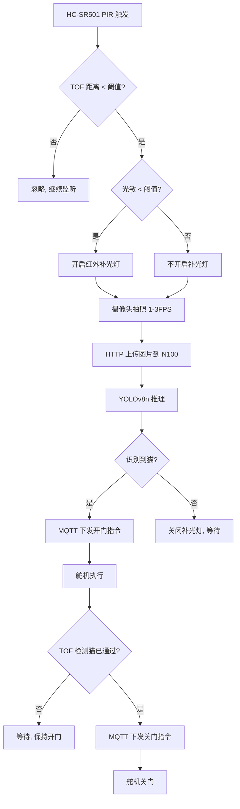

# 🐱 自动猫门系统方案可行性评估报告

## 一、总体评价

> **结论：方案整体可行，但有若干关键环节需要重新设计或优化。** 
> 系统的架构思路清晰，"PIR唤醒 → TOF确认 → 拍照识别 → 执行动作"的多级唤醒策略非常合理，能有效降低功耗和误判率。下面从硬件、软件、通信、机械结构、系统架构五个维度进行详细评估。

---

## 二、逐组件评估

### 1. HC-SR501 红外传感器 ⚠️ 有风险

| 项目         | 评估                                                         |
| ------------ | ------------------------------------------------------------ |
| **可行性**   | ⚠️ 中等风险                                                   |
| **核心问题** | HC-SR501 设计用于检测**人体**（~37°C 热源移动），猫的体温约 38-39°C，体型小，热辐射面积远小于人体。实际使用中可能存在**灵敏度不足**或**检测盲区**的问题 |

**具体风险：**
- **猫体型小**：HC-SR501 的菲涅尔透镜针对人体大小的热源优化，猫经过时可能只触发微弱信号。
- **最低触发延时**：HC-SR501 有约 2.5 秒的最小延迟时间，猫快速通过时可能来不及响应。
- **初始化锁定期**：上电后约 30 秒的初始化时间，期间可能误触发。
- **抗干扰差**：容易被暖气、阳光、空调出风口等误触发。

**建议：**
- ✅ 将菲涅尔透镜更换为**宠物专用透镜**（检测角度更低、更聚焦地面）。
- ✅ 灵敏度电位器调到最高，并配合 TOF 雷达做二次确认来过滤误触发（你已做了这一点，很好）。
- ✅ 考虑增加一个 **微波雷达传感器（如 RCWL-0516）** 作为补充触发源，微波对猫的运动更敏感。
- ⚡ 安装高度建议：距地面 20-40cm，对准猫经常经过的路径。

### 2. 光敏电阻 ✅ 可行

| 项目       | 评估                       |
| ---------- | -------------------------- |
| **可行性** | ✅ 完全可行                 |
| **成本**   | 极低                       |
| **复杂度** | 低，ESP32 ADC 直接读取即可 |

**注意事项：**
- ESP32-S3 的 ADC 线性度一般，建议多次采样取均值。
- 光敏电阻响应速度较慢（~20ms），但此场景完全够用。
- 安装时注意避免红外补光灯自身的光干扰到光敏电阻（加遮光隔板）。

### 3. 红外补光灯 ✅ 可行

| 项目         | 评估                                              |
| ------------ | ------------------------------------------------- |
| **可行性**   | ✅ 完全可行                                        |
| **注意事项** | 需匹配摄像头的 IR 敏感波长（通常 850nm 或 940nm） |

**建议：**
- 850nm 补光灯会有微弱红光可见，但照射距离更远。
- 940nm 完全不可见，但效率稍低。
- 确认你的摄像头移除了 IR-cut 滤光片（ESP32-S3-CAM 自带的 OV2640 通常有 IR-cut，需要确认或更换无 IR-cut 版本）。

### 4. TOF 雷达模块 ✅ 可行

| 项目         | 评估                                     |
| ------------ | ---------------------------------------- |
| **可行性**   | ✅ 可行                                   |
| **推荐型号** | VL53L1X（测距范围 4m）优于 VL53L0X（2m） |

**分析：**
- 你的流程是 PIR 触发后才启动 TOF 测距，这个设计很好，能节省功耗。
- TOF 的波束角较小（VL53L0X 约 25°），需要确保对准猫经过的区域。
- 建议使用 **VL53L1X**，可测 4m 远，支持可调 ROI（感兴趣区域），更适合此场景。
- 两个 TOF 通过 I2C 连接 ESP32-S3，需注意 I2C 地址冲突，需要上电时通过 XSHUT 引脚分别初始化不同地址。

### 5. 摄像头 + ESP32-S3-CAM ✅ 可行

| 项目         | 评估                               |
| ------------ | ---------------------------------- |
| **可行性**   | ✅ 可行                             |
| **拍照速度** | 3 FPS 在 VGA(640×480) 分辨率下可行 |
| **图像传输** | HTTP 上传可行但非最优              |

**GPIO 资源分析（单侧）：**
- 摄像头（OV2640）占用约 14 pin（板载已用）。
- 额外需要：PIR(1) + ADC(1) + 补光灯(1) + I2C(2) + 舵机PWM(2) = 7 个 GPIO。
- ESP32-S3 有 45 个 GPIO，**资源充足，没有问题。**

**关于 3 FPS 拍照上传：**
- 拍照+压缩约 100-200ms/帧，局域网内 HTTP POST 上传约 50-100ms。
- **3 FPS 基本可行**，但建议实际降到 1-2 FPS 更稳定（对猫识别已足够）。

### 6. N100 Mini 主机 + YOLOv8n ⚠️ 需优化

| 项目         | 评估                            |
| ------------ | ------------------------------- |
| **可行性**   | ⚠️ 可行但需注意推理速度          |
| **核心问题** | N100 纯 CPU 推理 YOLOv8n 的速度 |

**性能分析：**
- N100 纯 CPU（PyTorch）：约 5-10 FPS（640×640 输入）。
- 使用 **ONNX Runtime + OpenVINO** 优化后：可达 **~15-25 FPS**。
- 你的输入是 1-3 FPS 的拍照，所以 **N100 的推理能力完全够用**。

**建议：**
- ✅ 导出模型为 **ONNX 格式**，使用 **OpenVINO** 推理后端（Intel CPU 深度优化）。
- ✅ 输入分辨率可降低到 320×320 或 416×416，推理速度提升 2-3 倍。

### 7. 舵机系统 🔴 高风险

| 项目         | 评估                           |
| ------------ | ------------------------------ |
| **可行性**   | 🔴 高风险，是整个方案最大的难点 |
| **核心问题** | 开门所需的扭矩远超普通舵机能力 |

**具体风险：**
- **舵机 1（下拉门把手）**：需要 10-20 kg·cm 以上扭矩，普通 SG90 仅 1.8 kg·cm，MG996R 约 13 kg·cm。需要大扭矩舵机（如 DS3218 25kg·cm）或连杆增力机构。
- **舵机 2（法线推拉门）**：室内门重 15-30kg，推动门开启需要的力远大于舵机能力，即使是 25kg·cm 的舵机直接推门也非常困难。

**建议方案（优先级从高到低）：**
1. **🌟 改用猫门/猫 flap 替代开大门**（最推荐）：舵机只需控制猫门的锁止/解锁机构，力矩需求大幅降低（<2 kg·cm 即可）。
2. **改用直线推杆（Linear Actuator）**：12V 直线推杆可提供 50-150N 的推力，比舵机更适合推门。
3. **使用电磁锁方案**：如果只需要解锁，用 **电磁锁** 控制门锁开关，猫自己推门进出。

---

## 三、系统流程评估与优化建议

### 流程梳理：

PIR 检测到运动 → TOF 测距确认 → 光敏判断光照 → 开启补光灯(如需) →
摄像头拍照 → HTTP 上传图片 → N100 YOLOv8n 推理 →
识别到猫 → MQTT 下发开门指令 → 舵机执行开门

### 流程图：



### 需要补充的逻辑：

1. **🔴 关门安全检测**：关门过程中必须检测猫是否还在门缝中，否则可能夹到猫。建议在门缝处增加一个 **对射式红外传感器** 或 **压力感应条**，关门时检测到障碍物立即停止并反向开门。
2. **超时保护**：开门后如果猫一直不通过，应设置最大开门时长（如 30 秒），超时自动关门。
3. **断电/断网保护**：WiFi 断开时，ESP32 应有本地降级逻辑（如仅靠 PIR+TOF 做简单判断开门）。

## 四、通信与架构优化

### 原方案：

- ESP32 与 N100 之间：MQTT（指令） + HTTP（图片） + ROS2（中间件）

### 评估与建议：

ROS2 对你的场景来说属于**过度设计**，引入的 DDS 中间件会增加学习成本和系统开销。建议**去掉 ROS2**，改用轻量级架构。

**推荐简化架构：**

┌─────────────────────────────────────────────────────┐
│                  N100 Mini PC (Ubuntu 24.04)         │
│                                                     │
│  ┌──────────┐  ┌──────────┐  ┌───────────────────┐  │
│  │Mosquitto │  │ FastAPI  │  │ Python 推理服务    │  │
│  │MQTT      │  │ HTTP接收  │  │ OpenVINO+YOLOv8n  │  │
│  │Broker    │  │ 图片服务  │  │ (替代 ROS2)       │  │
│  └────┬─────┘  └────┬─────┘  └────────┬──────────┘  │
│       │              │                 │              │
│       └──────────────┼─────────────────┘              │
└──────────────────────┼────────────────────────────────┘
                       │ WiFi (LAN)
          ┌────────────┼────────────┐
          │            │            │
    ┌─────┴─────┐ ┌────┴────┐ ┌─────┴─────┐
    │ ESP32-S3  │ │ ESP32   │ │  手机APP  │
    │ CAM (门外) │ │ (门内)  │ │           │
    │           │ │         │ │           │
    │ PIR+TOF   │ │ PIR+TOF │ │ MQTT手动  │
    │ 光敏+IR灯 │ │ +舵机×2 │ │ 控制      │
    │ 摄像头    │ │         │ │           │
    │ 舵机×2    │ │         │ │           │
    └───────────┘ └─────────┘ └───────────


```
1
2### 流程图：
3
4```mermaid
5graph TD
6    A[HC-SR501 PIR 触发] --> B{TOF 距离 < 阈值?}
7    B -- 否 --> Z[忽略, 继续监听]
8    B -- 是 --> C{光敏 < 阈值?}
9    C -- 是 --> D[开启红外补光灯]
10    C -- 否 --> E[不开启补光灯]
11    D --> F[摄像头拍照 1~3FPS]
12    E --> F
13    F --> G[HTTP 上传图片到 N100]
14    G --> H[YOLOv8n 推理]
15    H --> I{识别到猫?}
16    I -- 是 --> J[MQTT 下发开门指令]
17    I -- 否 --> K[关闭补光灯, 等待]
18    J --> L[舵机执行]
19    L --> M{TOF 检测猫已通过?}
20    M -- 否 --> N[等待, 保持开门]
21    M -- 是 --> O[MQTT 下发关门指令]
22    O --> P[舵机关门]
```

### 需要补充的逻辑：

1. **🔴 关门安全检测**：关门过程中必须检测猫是否还在门缝中，否则可能夹到猫。建议在门缝处增加一个 **对射式红外传感器** 或 **压力感应条**，关门时检测到障碍物立即停止并反向开门。
2. **超时保护**：开门后如果猫一直不通过，应设置最大开门时长（如 30 秒），超时自动关门。
3. **断电/断网保护**：WiFi 断开时，ESP32 应有本地降级逻辑（如仅靠 PIR+TOF 做简单判断开门）。

------

## 四、通信与架构优化

### 原方案：

- ESP32 与 N100 之间：MQTT（指令） + HTTP（图片） + ROS2（中间件）

### 评估与建议：

ROS2 对你的场景来说属于**过度设计**，引入的 DDS 中间件会增加学习成本和系统开销。建议**去掉 ROS2**，改用轻量级架构。

**推荐简化架构：**

```
1┌─────────────────────────────────────────────────────┐
2│                  N100 Mini PC (Ubuntu 24.04)         │
3│                                                     │
4│  ┌──────────┐  ┌──────────┐  ┌───────────────────┐  │
5│  │Mosquitto │  │ FastAPI  │  │ Python 推理服务    │  │
6│  │MQTT      │  │ HTTP接收  │  │ OpenVINO+YOLOv8n  │  │
7│  │Broker    │  │ 图片服务  │  │ (替代 ROS2)       │  │
8│  └────┬─────┘  └────┬─────┘  └────────┬──────────┘  │
9│       │              │                 │              │
10│       └──────────────┼─────────────────┘              │
11└──────────────────────┼────────────────────────────────┘
12                       │ WiFi (LAN)
13          ┌────────────┼────────────┐
14          │            │            │
15    ┌─────┴─────┐ ┌────┴────┐ ┌─────┴─────┐
16    │ ESP32-S3  │ │ ESP32   │ │  手机APP  │
17    │ CAM (门外) │ │ (门内)  │ │           │
18    │           │ │         │ │           │
19    │ PIR+TOF   │ │ PIR+TOF │ │ MQTT手动  │
20    │ 光敏+IR灯 │ │ +舵机×2 │ │ 控制      │
21    │ 摄像头    │ │         │ │           │
22    │ 舵机×2    │ │         │ │           │
23    └───────────┘ └─────────┘ └───────────┘
```

**门内系统简化：**
门内无需图像识别和光照测量，不需要 ESP32-S3-CAM，建议降级使用更便宜的 **ESP32-C3** 或普通 **ESP32**，仅需：PIR 触发 → TOF 确认 → MQTT 通知 N100 → 开门。


---

## 五、实施变更说明（2026-09-25 追加）

本节记录从评估报告到当前代码实现之间的主要差异，便于回溯设计取舍。

### 5.1 已采纳

| 评估建议 | 实施状态 |
|----------|----------|
| 使用 VL53L1X 替代 VL53L0X | ✅ 每侧 1 片，使用默认 I2C 地址 `0x29` |
| 去掉 ROS2，改用轻量级 TCP | ✅ 私有 TCP 协议，单端口 `:1234`，角色由 `0x8` 帧声明 |
| ONNX INT8 推理 | ✅ `model-training/best_int8.onnx` 已导出；`detect.py` 长驻 |
| N100 降低推理分辨率 | ⏳ 当前仍用 640×640（CPU 足够），后续可降至 416×416 |
| PIR + TOF 二次确认 | ❌ 未引入 PIR（仅 TOF）—— 见 §5.2 |
| 猫 flap / 直线推杆替代舵机 | ⏳ 仍保留 SG90/MG996R 舵机接口；现场扭矩验证后再决定是否替换 |

### 5.2 未采纳 / 偏离

1. **HC-SR501 PIR 已弃用**。原方案担心猫体型小、HC-SR501 灵敏度过低，最终直接只用每侧 1 片 VL53L1X。VL53L1X 短距模式（≤1.3 m）足以覆盖门前区域；后续若发现抖动，可加 PIR 做二次确认或扩到双雷达。
2. **门内仍是 ESP32-S3-CAM**（未降级为 ESP32-C3）。原因：用户后期加入"门内雷达触发时拍单帧 JPEG 留存"的需求（→ 协议 `0x9` + `--save-dir`），必须保留相机能力。代价：门内 ESP32 多花 ~$5，但布线与门内舵机 + 雷达逻辑共用一块板，开发/维护更简单。
3. **未引入 PIR + TOF 二次确认**：仅做单次 TOF 判定（`distance ≤ THRESHOLD` 即视为有猫）。评估报告建议 ≥ 2 次连续采样综合判断，避免抖动误触——**当前未实现，待现场验证后补齐**。
4. **未实现关门安全检测**（门缝对射红外 / 压力感应条）。**上线前必须补齐**，否则有夹猫风险。
5. **未实现断电/断网降级**：WiFi 断开时 ESP32 当前会持续重连，无本地降级逻辑。
6. **iOS APP / PostgreSQL 日志**：仅协议层留了 `0x5`/`0x6` 远程控制位，APP 与数据库均未实现。
7. **通信协议从 MQTT+HTTP 改为单 TCP 私有协议**：协议 spec 见 `docs/通信协议设计.md`。MQTT 在 LAN 上 QoS 收益不大、反而增加 broker 部署成本，故简化为直连。

### 5.3 实际双向流（与原流程图差异）

评估报告原流程图只描述了"进入"一个方向。当前实现支持**双向**：

- **进入（外→内）**：门外 `0x1` + YOLO=cat → 服务端下发 `0x5` → 门内 `0x7{passage}` 关门。
- **出门（内→外）**：门内雷达触发 → 拍单帧 JPEG → `0x9` 上报 → 服务端直接 `0x5` 开锁 → 门外 `0xA` 关门。

完整时序与状态机见 `docs/系统工作流程.md` §"系统工作流程"、§"通过事件的双向过滤"。

### 5.4 实施状态总表

| 项目 | 状态 |
|------|------|
| 协议 `0x1` / `0x2` / `0x5` / `0x6` / `0x7` / `0x8` / `0xF` | ✅ 已实现 |
| 协议 `0x9`（门内触发开锁+JPEG） | ✅ 已实现 |
| 协议 `0xA`（门外通过事件） | ✅ 已实现 |
| `--save-dir` 图片留存 | ✅ 已实现 |
| YOLOv8n INT8 ONNX 推理 | ✅ 已实现 |
| 关门安全检测 | ❌ 未实现，上线前必做 |
| 雷达抖动二次确认 | ❌ 未实现，建议补齐 |
| 断网本地降级 | ❌ 未实现 |
| iOS APP | ❌ 未实现 |
| PostgreSQL 日志 | ❌ 未实现 |

